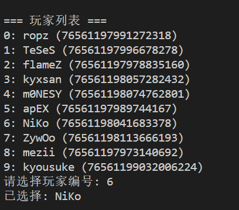
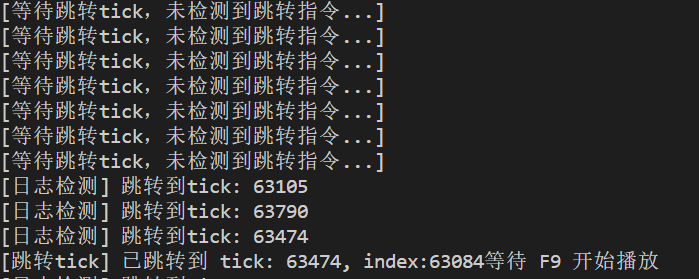

# CS2 Demo Visualizer 🖱️🎮

一个基于 **PyQt5 和 demoparser2** 的可视化工具，用于播放和分析 **CS2 demo 文件**，提供玩家操作与状态的直观展示。  
支持鼠标轨迹、速度曲线、按键状态等叠加显示，让你更直观地复盘比赛操作。 

- **鼠标轨迹显示 (Mouse Overlay)**  
    - 实时绘制玩家在 demo 中的鼠标移动轨迹  
    - 支持缩放比例和位置偏移调节  
    - 轨迹有动态残影效果  

- **速度叠加层 (Velocity Overlay)**  
    - 左下角显示速度曲线  
    - 支持区分是否开火（折线颜色不同）  
    - 显示当前速度数值  
    - 根据武器精度（不同武器的速度准确度限制）绘制参考横线  

- **按键展示 (Key Overlay)**  
    - 显示玩家当前按下的按键（WASD、空格、蹲下等）  
    - 武器切换键（1/2/3/4、Z/X/C/V）会像真实操作一样短暂保持  
    - 键位是按照最基本的键位来的

---

## 🚀 使用说明

### 1. 安装依赖
```bash
pip install -r requirements.txt
```

### 2. 准备 Demo

下载 CS2 的 demo 文件，并在 `main.py` 中修改：

```python
DEMO_PATH = r"C:\\Users\\xxx\\demo\\your_demo.dem"
```

⚠️ 注意 Windows 路径中的反斜线要写成 `\\` 或者用 `r""`。

### 3. 配置 Console 日志

1. 启动 CS2，在启动项添加：

   ```
   -condebug
   ```

   这样游戏运行时会生成一个 `console.log` 文件。

2. 在 `src/config.py` 中配置路径，例如：

   ```python
   CONSOLE_LOG_PATH = r"D:\\SteamLibrary\\steamapps\\common\\Counter-Strike Global Offensive\\game\\csgo\\console.log"
   ```

3. 在你的 cfg 文件中添加以下内容（实现 `F9` 播放/暂停 demo）：

   ```config
   alias "demopause" "demo_pause;bind F9 demoresume"
   alias "demoresume" "demo_resume;bind F9 demopause"
   bind "F9" "demoresume"
   ```

   打开 demo 后，按 `F9` 即可暂停，注意这里一定要通过`F9`，否则无法同步播放

### 4. 运行程序

```bash
python main.py
```

等待解析完成后，选择要观看的主视角（第一次解析可能需要几分钟）：


### 5. 跳转到指定时间点 ⭐

此时控制台会提示 **等待跳转**。
在游戏中点击进度条 / 下一回合 / 击杀跳转到你想看的位置。

* 如果控制台提示已跳转，并且 **index 与 tick 相差不大**，说明成功。
* 如果 **tick 不为 0 但 index 为 0**，说明出现 bug，只需在附近再跳转一次即可。
  

### 6. 同步播放

保持游戏处于焦点状态，按下 `F9`，此时 **demo 与可视化叠加层会同时播放**。

### 7. 再次跳转

若需要跳转到其他时间点：

1. 先按下 `F9` 暂停播放
2. 在游戏中完成跳转
3. 等待提示后，再次按下 `F9` 播放

---

## ⚠️ 注意事项

* **长时间播放的延迟**
  我自己测试过 30 分钟的 demo，累计时差几乎可以忽略。
  如果你感觉延迟过大，重复 **步骤 7** 即可重新对齐。

* **偶尔出现的按键卡住**
  目前未完全定位原因，一般重启程序即可解决。

* **鼠标轨迹抖动**
  暂时没修，后续可能会尝试通过时间间隔复位来优化。

---

## 🤝 贡献与使用

你可以自由修改、二创、录视频使用本项目。
如果能在视频里标注一下来源就更棒啦\~

如果这个项目对你有帮助，点个 ⭐Star 支持一下作者吧！